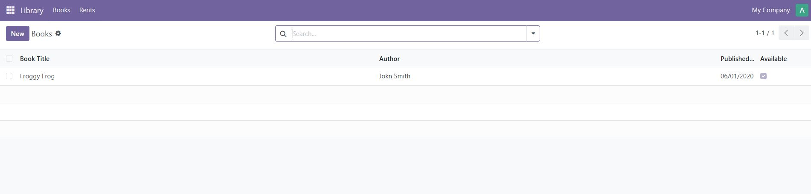
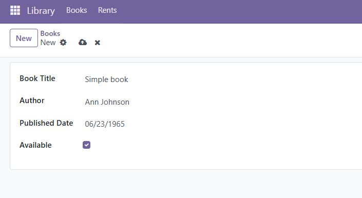
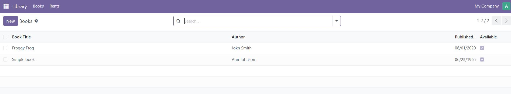
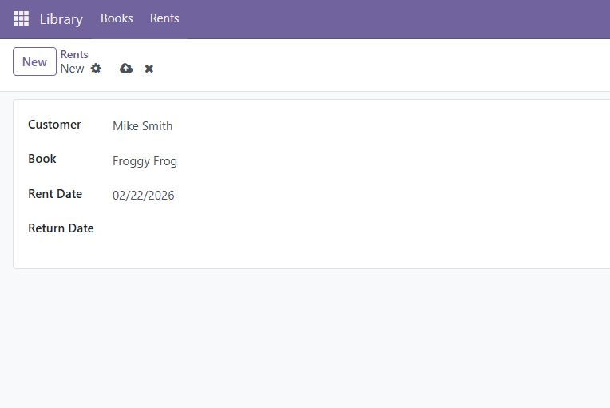
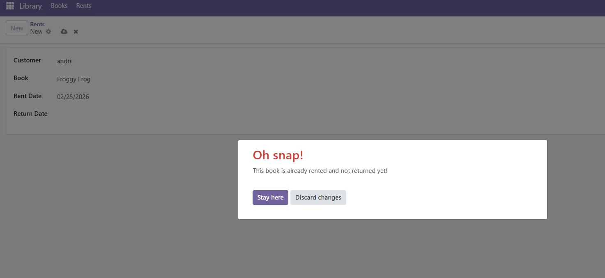
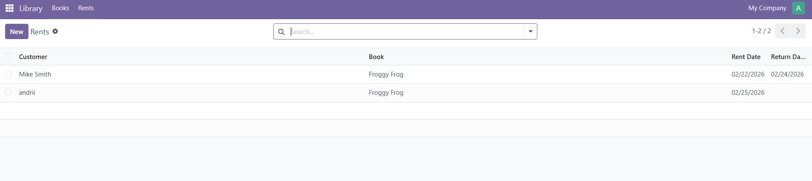

# Library-management
> Additional information or tagline

A small project to create a library management module

## Getting started


```shell
docker compose up -d
go to http://localhost:8069
create new database
push Update Apps List
find module Library management
push the install button

```
## Presentation
By selecting the module in the menu we can see that we have the books and rent tabs


We can create book



book created



users can rent books



If someone tries to rent a book that hasn't been returned yet, they will get an error.



if the book is returned, then you can safely take it

